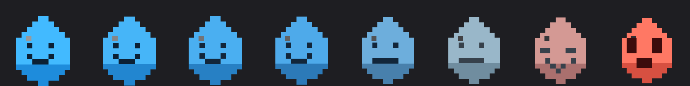

# PixelDrop

[English](README.en.md)


Ekranda yaşayan, piksel-art bir su damlası maskotuyla su içmeyi hatırlatan
hafif bir Windows masaüstü aracı (TBH: Task Bar Hero mantığında).

## Ekran görüntüleri

Maskotun halleri — mutludan susamışlığa:



> Masaüstü, ayarlar penceresi ve 7 günlük grafik ekran görüntüleri ile
> kısa bir tanıtım GIF'i eklenecek (bkz. [yol haritası](pixeldropyolharitasi.md)).

## İndir

**[En son sürümü indir (GitHub Releases)](https://github.com/OrhuunA/PixelDrop/releases/latest)**

> **Not:** İmzasız `.exe` dosyaları Windows SmartScreen, Chrome ya da
> Windows Defender tarafından bazen yanlışlıkla "zararlı yazılım" olarak
> işaretlenebiliyor — bu, PyInstaller ile derlenen hemen her uygulamada
> karşılaşılan bilinen bir durum ve kodda gerçek bir kötü amaçlı davranış
> olduğu anlamına gelmiyor. Ayrıntı ve çözüm yolları için aşağıdaki
> [SmartScreen / antivirüs uyarısı](#windows-smartscreen-ve-antivirüs-uyarısı)
> bölümüne bak.

İndirmek istemiyorsan, kaynak koddan çalıştırmak için aşağıdaki
[Çalıştırma (geliştirme)](#çalıştırma-geliştirme) bölümüne bak.

## Özellikler

- **Masaüstü widget'i**: Küçük, çerçeve/başlık çubuğu olmayan, şeffaf
  arka planlı, her zaman en üstte duran bir karakter. Zaman geçtikçe
  maskotun ifadesi değişir: mutlu → nötr → susamış → acil (kırmızı,
  yanıp söner). Su içince tekrar mutlu olur ve kısa bir "sevinme"
  animasyonu yapar.
- **Sürükle-bırak**: Karaktere tıkla-sürükle ile ekranda istediğin yere
  taşı (konum kaydedilir). Tek tıklama (sürüklemeden) = "su içtim".
- **Fareyle üzerine gelince** sağ üst köşede üç simge belirir: **💤**
  bildirimi 5 dakika erteler, **⚙** küçük bir ayarlar penceresi açar
  (aralık, boyut, günlük hedef, duraklat, otomatik duraklama, ses,
  başlangıçta çalıştır — hepsi widget'tan, tepsiye gitmeden), **✕**
  widget'i gizler (tepsi menüsünden "Widget'i göster" ile geri
  getirilebilir). Aralarında yanlışlıkla birbirine basmayı önlemek için
  boşluk var; üstelik hangisine daha yakın tıklandıysa o seçilir.
- **Kademeli kuruma**: karakterin rengi su içmedikçe yavaş yavaş canlı
  mavi-mutludan soluk/kırmızımsı-kurumuşa geçer (parlaklık/nem izlenimi
  de azalır), aniden değil sürekli/akıcı bir geçişle.
- **İlerleme çubuğu**: Widget'in altında, bir sonraki hatırlatmaya kalan
  süreyi gösteren küçük bir çubuk + geri sayım yazısı.
- **Günlük hedef + seri (streak)**: Widget'te, geri sayımın üstünde
  günlük kaç bardak içildiğini gösteren küçük bardak simgeleri satırı
  (dolu/mavi = içildi, boş/soluk çerçeve = kaldı) — hedef 8'den
  büyükse yer kısıtından dolayı "3/10 bardak" şeklinde metne döner.
  Hedefe (varsayılan 8 bardak, ayarlardan değiştirilebilir) ulaşınca
  karakter daha uzun/enerjik bir şekilde "sevinir" ve ayrıca bir
  kutlama bildirimi gelir. Gece yarısını geçtiğinde (uygulama açık
  kalsa bile) sayaç otomatik sıfırlanır, önceki gün hedefe ulaşıldıysa
  seri (kaç gün üst üste hedefi tuttuğun) bir artar, tutulmadıysa
  sıfırlanır. Seri sayısı ayarlar penceresinde görünür.
- **Boşta/uzaktayken otomatik duraklama**: Klavye/fare 10 dakikadır
  kullanılmadıysa hatırlatıcı "uzakta" durumuna geçip otomatik
  duraklar (bildirim gelmez); geri dönünce sayaç sıfırlanıp normal
  akışına devam eder, böylece bilgisayardan uzaktayken boş yere
  bildirim birikmez. Ayarlardan kapatılabilir.
- **Bildirimden hızlı erteleme**: Widget üzerindeki 💤 simgesi ya da
  tepsi menüsündeki "5 dk ertele" ile bir sonraki hatırlatmayı 5 dakika
  geciktir.
- **Ayarlarda 7 günlük mini geçmiş**: Ayarlar penceresinde son 7 günün
  ne kadar su içildiğini gösteren küçük bir çubuk grafik; hedefe
  ulaşılan günler vurgulu renkte görünür.
- **Dil (Türkçe / English)**: Ayarlar penceresinden dil değiştirilebilir;
  widget, tepsi menüsü, ayarlar penceresi ve bildirim metinleri
  (başlık/içerik) seçilen dile göre gösterilir. Varsayılan Türkçe.
- **Tepsi (tray) simgesi**: Aynı maskot, küçük boyutta, sistem
  tepsisinde de durur; sağ tıkla menüden tüm ayarlara erişilir.
- **Aralık**: 15/30/45/60/90/120 dakika arasında seçim.
- **Günlük hedef**: 4/6/8/10/12/15 bardak arasında seçim.
- **Duraklat/Devam et**, **Bildirim sesi aç/kapa**.
- **Windows başlangıcında çalıştır**: Açılınca otomatik başlar.
- Native Windows 10/11 toast bildirimi (`winotify`) ile hatırlatma; ayrıca
  sistem sesi (`winsound`) ile de bir "bip" çalar — toast'un kendi sesi
  bazen Windows'un bildirim ayarları yüzünden (özellikle "Odaklanma
  Yardımcısı"/oyun modu açıkken) sessiz kalabildiği için bu ikinci ses
  yolu daha güvenilir.

## Kullanım

- Ekranda beliren maskota **tek tıkla** = su içtim (sayaç sıfırlanır,
  günlük hedefe bir adım daha yaklaşılır).
- Maskotu **sürükle** = konumunu değiştir.
- Maskotun sağ üstündeki **💤** = bir sonraki hatırlatmayı 5 dakika
  ertele, **⚙** = ayarlar, **✕** = widget'i gizle (uygulama arka
  planda, tepsi simgesinden çalışmaya devam eder).
- Tepsi simgesine **sağ tıkla** = tüm ayarlar (aralık, günlük hedef,
  erteleme, duraklat, otomatik duraklama, widget'i tekrar göster, ses,
  başlangıçta çalıştır, çıkış).

Ayarlar (aralık, günlük hedef, widget konumu/boyutu, günlük sayaç,
seri, geçmiş, vb.) `%APPDATA%\PixelDrop\config.json`
dosyasında saklanır. (Uygulama eskiden "Su İçme Hatırlatıcı" adıyla
biliniyordu — eski `%APPDATA%\SuIcmeHatirlatici\config.json` varsa
ilk açılışta otomatik olarak yeni konuma bir kez kopyalanır, hiçbir
veri kaybolmaz.)

## Çalıştırma (geliştirme)

```
pip install -r requirements.txt
python main.py
```

Konsol penceresi olmadan, arka planda sessizce çalıştırmak için:

```
pythonw main.py
```

En kolay yol: `kur_ve_test_et.bat` dosyasına çift tıkla — bağımlılıkları
kurar, bir test bildirimi gönderir ve uygulamayı başlatır.

## .exe olarak paketleme

`exe_olustur.bat` dosyasına çift tıkla (ya da terminalden çalıştır).
Çıkan dosya: `dist\PixelDrop\PixelDrop.exe` (yanında birkaç destek
dosyasıyla birlikte, tek bir klasör içinde).

Paketledikten sonra "Windows başlangıcında çalıştır" seçeneğini tekrar
aç/kapa ki başlangıç kaydı .py yerine .exe'yi göstersin.

### Windows SmartScreen ve antivirüs uyarısı

PyInstaller ile derlenen exe'ler (özellikle eskiden kullanılan tek
dosyalık `--onefile` modu), çalışırken kendini geçici bir klasöre açması
yüzünden Windows Defender, Chrome'un güvenli tarama özelliği ve Google
tarafından sık sık yanlışlıkla "zararlı yazılım" olarak işaretlenir. Bu,
PyInstaller kullanan hemen her projede karşılaşılan, iyi bilinen bir
sorun — kodda gerçek bir kötü amaçlı davranış olduğu anlamına gelmez.
Sebebi basit: **ücretsiz, imzasız bir açık kaynak projesinin kod imzalama
sertifikası yok** (bu sertifikalar yıllık ücretli).

Eğer indirdiğin dosyada "Windows PC'nizi korudu" (SmartScreen) uyarısı
görürsen:

1. Uyarı penceresinde **"Diğer bilgiler" / "More info"** yazısına tıkla.
2. Ardından çıkan **"Yine de çalıştır" / "Run anyway"** butonuna bas.

Google/Chrome ya da Windows Defender belirli bir dosyayı yanlışlıkla
engelliyorsa, "yanlış pozitif" olarak bildirebilirsin:
[Microsoft dosya inceleme](https://www.microsoft.com/en-us/wdsi/filesubmission) ·
[Google Safe Browsing hata bildirimi](https://safebrowsing.google.com/safebrowsing/report_error/)
— inceleme genelde birkaç gün içinde sonuçlanır.

Bunu azaltmak için ayrıca:

- `exe_olustur.bat` artık `--onedir` (klasör) modunda ve `--noupx` ile
  derliyor — tek dosyalık sürümden daha az yanlış pozitif alır.
- Paylaşırken tek başına `PixelDrop.exe`yi değil, `dist\PixelDrop\`
  klasörünün tamamını ZIP'leyip öyle paylaş.

**Kaynak kod tamamen açık** — güvenmiyorsan indirmek yerine
`exe_olustur.bat` ile kendi bilgisayarında kendi başına derleyebilirsin;
bu şekilde ürettiğin exe de kendi makinende olduğu için hiçbir indirme
uyarısı görmezsin.

## Notlar / mimari

- Arayüz: `tkinter` (stdlib, ekstra kurulum gerekmez) ile şeffaf,
  çerçevesiz bir Toplevel penceresi. Karakterin piksel-art görseli
  çalışma zamanında Pillow ile çiziliyor (harici dosya yok).
- Tepsi simgesi: `pystray`, `run_detached()` ile tkinter'in ana
  döngüsünü bloklamadan çalışır.
- Zamanlama: ekstra thread/`sleep` döngüsü yerine tkinter'in
  `after()` çağrıları kullanılır (saniyede bir durum kontrolü, ~70ms'de
  bir hafif "nefes alma" animasyonu) — böylece boşta CPU kullanımı
  neredeyse sıfıra yakın kalır.
- Boşta/uzaktayken otomatik duraklama, Windows'un `GetLastInputInfo`
  API'siyle (stdlib `ctypes` üzerinden, ekstra kurulum gerekmez) son
  klavye/fare girdisinden bu yana geçen süreyi ölçer; Windows dışında
  ya da API erişilemezse özellik sessizce devre dışı kalır.
- Günlük hedef/seri ve 7 günlük geçmiş, `config.json` içindeki
  `history` alanında (tarih → içilen bardak) son 14 gün saklanarak
  hesaplanır; gün dönüşü artık sadece başlangıçta değil, her saniyelik
  `_tick` kontrolünde de yapılır, böylece uygulama gece boyunca açık
  kalsa da gece yarısında doğru sıfırlanır.
- Diller `STRINGS` sözlüğünde (main.py içinde, "tr"/"en") tutulur;
  seçim `config.json`'daki `language` alanında saklanır. Widget/tepsi
  metinleri her yenilendiğinde güncel dili okur; ayarlar penceresindeki
  sabit etiketler ise dil değişince pencere yeniden açılarak güncellenir.

## Katkıda bulunma

Hata bildirimi ya da özellik önerisi için
[Issues](https://github.com/OrhuunA/PixelDrop/issues) sekmesinden yeni
bir kayıt açabilirsin — hazır şablonlar gerekli bilgileri (Windows
sürümü, adımlar, vb.) soracak. Geliştirme yönündeki plan için
[yol haritasına](pixeldropyolharitasi.md) göz atabilirsin.

## Lisans

[MIT](LICENSE)
